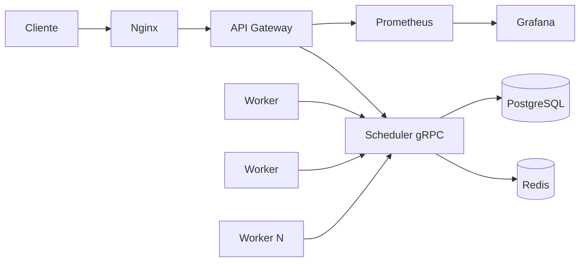

# Arquitectura

## Responsabilidades

- API Gateway: expone endpoints HTTP para usuarios y herramientas de prueba.
- Scheduler: asigna rangos, recibe reportes y emite cancelacion global.
- Worker: procesa rangos de candidatos y reporta resultados.
- Redis: coordina trabajo volatil de baja latencia.
- PostgreSQL: conserva estado durable para auditoria, recuperacion y analisis.

