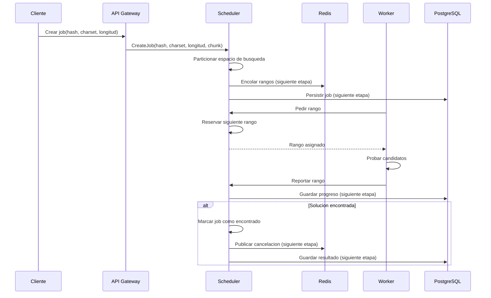

# Secuencia De Job

```mermaid
sequenceDiagram
  participant C as Cliente
  participant A as API Gateway
  participant S as Scheduler
  participant R as Redis
  participant W as Worker
  participant P as PostgreSQL

  C->>A: Crear job(hash, charset, longitud)
  A->>S: CreateJob(hash, charset, longitud, chunk)
  S->>S: Particionar espacio de busqueda
  S->>R: Encolar rangos (siguiente etapa)
  S->>P: Persistir job (siguiente etapa)
  W->>S: Pedir rango
  S->>S: Reservar siguiente rango
  S-->>W: Rango asignado
  W->>W: Probar candidatos
  W->>S: Reportar rango
  S->>P: Guardar progreso (siguiente etapa)
  alt Solucion encontrada
    S->>S: Marcar job como encontrado
    S->>R: Publicar cancelacion (siguiente etapa)
    S->>P: Guardar resultado (siguiente etapa)
  end
```
